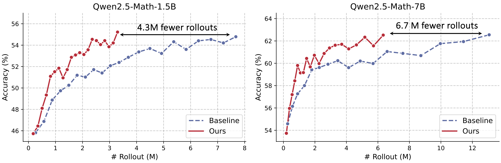

<div align="center">
<h1> Act Only When It Pays: Efficient Reinforcement Learning for LLM Reasoning via Selective Rollouts
</h1>

Haizhong Zheng<sup>1</sup>, Yang Zhou<sup>1</sup>, Brian R. Bartoldson<sup>2</sup>, Bhavya Kailkhura<sup>2</sup>,
<br>
Fan Lai<sup>3</sup>, Jiawei Zhao<sup>4</sup>, Beidi Chen<sup>1</sup>
<br>
<sup>1</sup>Carnegie Mellon University,
<sup>2</sup>Lawrence Livermore National Laboratory,
<br>
<sup>3</sup>University of Illinois Urbana-Champaign,
<sup>4</sup>Meta AI

<div align="center">
[<a href="https://arxiv.org/abs/2506.02177">Paper</a>] | [<a href="https://infini-ai-lab.github.io/GRESO/">Blog</a>]
</div>
<br>

<!-- ---------- -->
**TL;DR**
We propose GRESO, a lightweight pre-rollout filtering method that improves the efficiency of *rollout scaling* in LLM RL by predicting and skipping low-value prompts.
</div>


## 🗞️ News

- **[2025.06.03]** Blog post released: [Act Only When It Pays – GRESO](https://infini-ai-lab.github.io/GRESO/).
- **[2025.06.03]** Paper preprint available on [arXiv](https://arxiv.org/abs/2506.02177).

<!-- ---------- -->
<p align="center">
  
</p>

<p align="center"><i>
Figure 1: We train Qwen2.5-Math-1.5B/7B on the DAPO + MATH dataset and evaluate them on five math reasoning benchmarks: MATH500, AMC, Gaokao, Minerva, and Olympiad Bench. Compared to the baseline method (Dynamic Sampling), our approach (GRESO) reduces rollout overhead by up to 2x while achieving comparable training performance, improving the efficiency of rollout scaling.
</i></p>

<!-- ------- -->

## Getting Started
Our implementation is based on [volcengine/verl](https://github.com/volcengine/verl)
.

### 1. Environment Setup


```bash
conda create -n greso python==3.11
conda activate greso

pip3 install -e .
pip3 install vllm==0.8.2
pip install tensordict==0.6.0
pip install flash-attn==2.7.4.post1 --no-build-isolation

pip install wandb IPython matplotlib ipdb latex2sympy2-extended math-verify torchdata pylatexenc

```

### 2. Download & Preprocess Data

You can download the dataset using the following command:

```bash
# cd the project folder
conda activate greso
export PYTHONPATH="$PYTHONPATH:$(pwd)"

bash train-scripts/generate_dataset.sh
```

### 3. Training

Train Qwen Math 1.5b with GRESO on 4xH100:
```bash
bash train-scripts/math_qwen_1_5b_dm_greso.sh
```

Train Qwen Math 7b with GRESO on 8xH100:
```bash
bash train-scripts/math_qwen_7b_dm_greso.sh
```

See more scripts in `train-scripts` folder.
